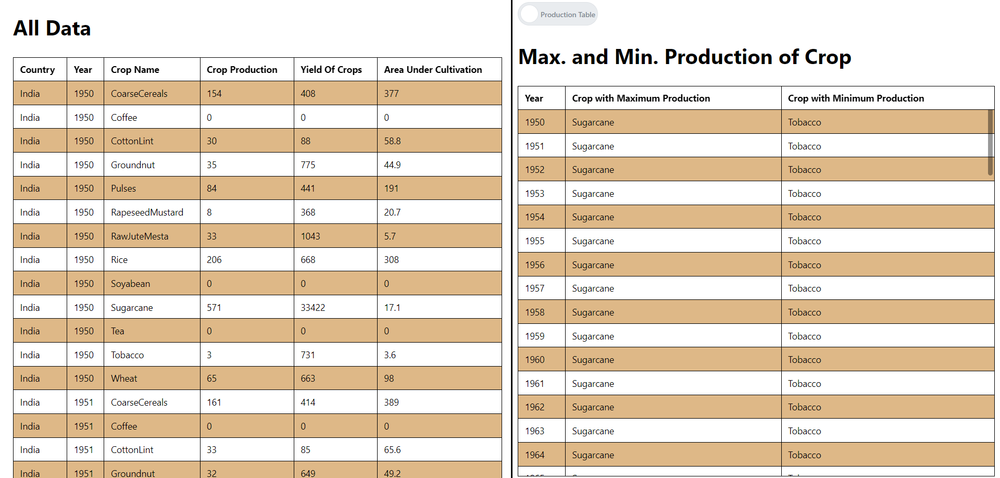

# Data Analysis Task

This project utilizes React to create two tables for visualizing and analyzing agricultural crop data from a JSON file.

## Available Scripts

In the project directory, you can run:

### `yarn`

Install all dependencies.

### `yarn start`

Runs the app in development mode. Open [http://localhost:3000](http://localhost:3000) to view it in the browser.

The page will reload if you make edits, and you will also see any lint errors in the console.

### `yarn test`

Launches the test runner in interactive watch mode. See the section about [running tests](https://facebook.github.io/create-react-app/docs/running-tests) for more information.

### `yarn build`

Builds the app for production to the `build` folder. It correctly bundles React in production mode and optimizes the build for the best performance. The build is minified, and the filenames include the hashes. Your app is ready to be deployed!

## Tables

The display area is divided into **two parts**. The first part contains a table showing all the data from the *Manufac _ India Agro Dataset*.

The second part contains two tables, which can be switched using a toggle button located at the top:

1. **First Table**: Shows the Max. and Min. Production details of each Year.

   

2. **Second Table**: Shows the Average Yield and Cultivation Area of each Crop between 1950 to 2000.

   

## References

1. Yarn React package manager - [Yarn](https://classic.yarnpkg.com/en/package/react)
2. Create React App - [Create React App](https://create-react-app.dev/)
3. TypeScript - [TypeScript](https://www.typescriptlang.org/)
4. Mantine: React Component Library for Table and Switch - [Mantine](https://mantine.dev/)
